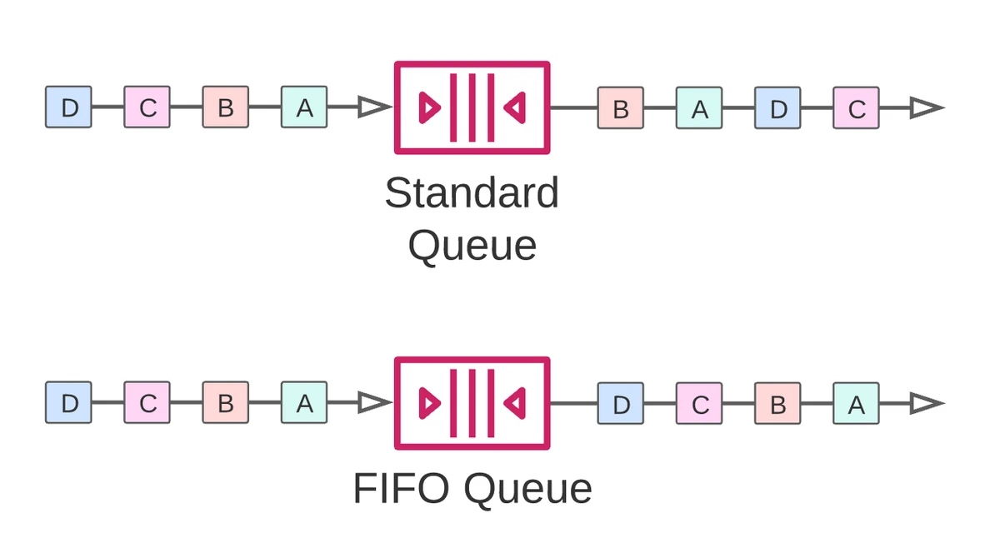
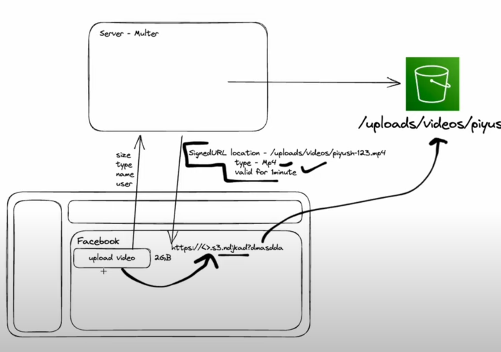

# AWS SERVICES

## Aws SQS

### Queue Type

### Visibility timeout

Visibility timeout sets the length of time that a message received from a queue (by one consumer) will not be visible to the other message consumers.If the consumer fails to process and delete the message before the visibility timeout expires, the message becomes visible to other consumers.

### Message retention period

Amazon SQS automatically deletes messages that have been in a queue for more than the maximum message retention period.

### Delivery delay

Any messages that you send to the queue remain invisible to consumers for the duration of the delay period in initial push.

### Maximum message size

You can set the maximum message size for your queue. The smallest supported message size is 1 byte (1 character). The largest size is 262,144 bytes (256 KB).

### Receive message wait time (Long Polling)

The receive message wait time is the maximum amount of time that polling will wait for messages to become available to receive.

### Dead Letter Queue

If a message can't be consumed successfully, you can send it to a dead-letter queue (DLQ). The Maximum receives value determines when a message will be sent to the DLQ. Amazon SQS moves the message to the associated DLQ (with its original message ID).

## AWS Lambda

1. Install serverless `npm i serverless -g`
2. Create a service `serverless`
3. `export AWS_ACCESS_KEY_ID=<your-key-here>`
4. `export AWS_SECRET_ACCESS_KEY=<your-secret-key-here>`
5. `sls deploy`
6. Serverless creates Creates CloudFormation Stack & S3 Bucket
7. `sls remove --stage dev --region ap-south-1`
8. `sls remove` #Deletes service

## AWS S3

For private bucket, use Pre-Signed URL for accessing the objects.

To upload videos, send directly from client without storing video in server by using pre-signed url (Temporary Access) generated by server & metadata.

To sign the cdn,

1. Use openssl to generate private_key.pem using `openssl genrsa -out private_key.pem 2048`
2. Generate public key for cloudfront using private key `openssl rsa -pubout -in private_key.pem -out public_key.pem`

Any updates to S3, need to invalidate in CDN.
